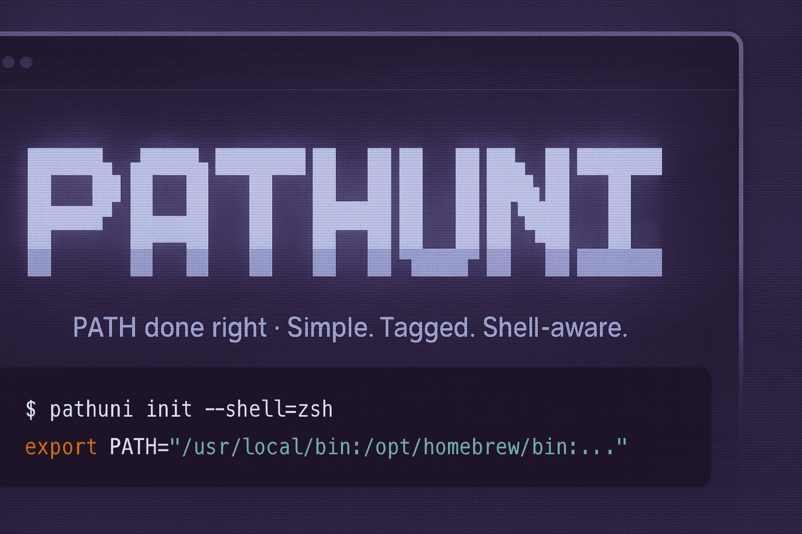

# Pathuni



A lightweight, cross-platform PATH management tool for dotfiles that work across multiple operating systems (macOS and Linux for now) and shells.

## What it does

Pathuni reads a simple YAML config file and generates shell-specific PATH export commands. It validates that directories exist before including them and supports platform-specific path lists.

## Installation

### Quick Install (Recommended)

```bash
# Install latest release
curl -sSL https://raw.githubusercontent.com/pmdci/pathuni/main/install.sh | bash
```

### Homebrew (Coming Soon)

```bash
brew tap pmdci/pathuni
brew install pathuni
```

### Manual Build

```bash
git clone https://github.com/pmdci/pathuni
cd pathuni
make build
make install  # copies to ~/.local/bin
```

### Download Binary

Download pre-built binaries from the [releases page](https://github.com/pmdci/pathuni/releases).

**macOS Users:** Downloaded binaries may be blocked by Gatekeeper. After downloading, run:

```bash
xattr -d com.apple.quarantine pathuni
```

Or alternatively:

```bash
codesign -s - pathuni # You might need additional flags
```

## Usage

Create `~/.config/pathuni/my_paths.yaml`:

```yaml
all:
  tags: [base, essential]                     # Platform-level tags
  paths:
    - "$HOME/.local/bin"                      # Inherits: [base, essential]
    - path: "$HOME/.cargo/bin"                # Explicit tags override inheritance
      tags: [rust, dev]

macos:
  tags: [mac, gui]                            # Platform-level tags for macOS
  paths:
    - "/opt/homebrew/bin"                     # Inherits: [mac, gui]
    - path: "/opt/homebrew/sbin"              # Explicit tags override
      tags: [admin, homebrew]
    - path: "/Applications/Docker.app/Contents/Resources/bin"
      tags: [docker, work]
    - path: "/usr/local/special"              # Explicit empty override
      tags: []                                # No tags (breaks inheritance)

linux:
  # No tags field - platform has no tags to inherit
  paths:
    - "/home/linuxbrew/.linuxbrew/bin"        # No inheritance = no tags
    - "/usr/local/bin"                        # No inheritance = no tags
    - path: "/home/linuxbrew/.linuxbrew/sbin" # Explicit tags still work
      tags: [admin, homebrew]
    - path: "/opt/simple/bin"                 # Path object without tags field
      # Missing tags field + no platform tags = no tags
```

### Shell-specific Configuration

PowerShell on macOS doesn't automatically load system paths from `/etc/paths` and `/etc/paths.d/` like Unix shells do. You can enable this with:

```yaml
macos:
  powershell:
    include_system_paths: true # Loads system paths for PowerShell
```

With this setting, PowerShell will get the same comprehensive PATH that zsh/bash get automatically, including standard system directories like `/usr/bin`, `/bin`, etc.

#### Classification and Tags (PowerShell on macOS)

You can control how those macOS system paths are classified and whether they
participate in tag filtering:

```yaml
macos:
  tags: [mac]
  powershell:
    include_system_paths: true
    include_system_paths_as: system   # or pathuni (default: system)
    # tags: [sys]                     # optional; used only when as=pathuni
```

- `include_system_paths_as: system` (default):
  - Treats `/etc/paths` and `/etc/paths.d/*` entries as System.
  - Dry-run marks them as `[.]` and counts as System.
  - Pruned by `-p system|all`; tag filters do not apply.

- `include_system_paths_as: pathuni`:
  - Injects those entries on the Pathuni side.
  - Dry-run marks them as `[+]` and counts as Pathuni.
  - Subject to tag filters and `-p pathuni|all`.
  - Tag semantics when `as=pathuni`:
    - tags omitted → inherit platform tags (like simple string paths)
    - `tags: [sys]` → explicit override tags
    - `tags: []` → explicit empty tags (break inheritance)

Quick examples:

```yaml
# A) Default: classify as system
macos:
  powershell:
    include_system_paths: true
    # include_system_paths_as: system (implicit)

# B) Taggable: classify as pathuni and attach tags
macos:
  powershell:
    include_system_paths: true
    include_system_paths_as: pathuni
    tags: [sys]

# C) Inherit platform tags
macos:
  tags: [mac]
  powershell:
    include_system_paths: true
    include_system_paths_as: pathuni
    # tags omitted → inherit [mac]

# D) Break inheritance (no tags)
macos:
  tags: [mac]
  powershell:
    include_system_paths: true
    include_system_paths_as: pathuni
    tags: []
```

### Platform-Level Tag Inheritance

You can now define tags at the platform level (`all`, `macos`, `linux`) that are automatically inherited by simple string paths. This reduces repetition and makes configuration more maintainable:

```yaml
all:
  tags: [base, essential]                     # All simple paths inherit these tags
  paths:
    - "/usr/local/bin"                        # Gets tags: [base, essential]
    - "/usr/bin"                              # Gets tags: [base, essential]
    - path: "/special/bin"                    # Explicit tags override inheritance
      tags: [admin, work]                     # Gets tags: [admin, work] - no inheritance
    - path: "/no/tags/bin"                    # Explicit empty array breaks inheritance
      tags: []                                # Gets no tags (not [base, essential])

macos:
  tags: [mac, desktop]                        # macOS-specific inheritance
  paths:
    - "/opt/homebrew/bin"                     # Gets tags: [mac, desktop]
    - path: "/Applications/Docker.app/Contents/Resources/bin"
      tags: [docker]                          # Gets tags: [docker] - overrides inheritance
```

**Key inheritance rules:**

- **Simple string paths** (like `"/usr/local/bin"`) inherit platform tags
- **Explicit path objects** with `tags:` field override inheritance completely
- **Empty tags array** (`tags: []`) explicitly means "no tags" (breaks inheritance)
- **Missing tags field** means "inherit platform tags"

This is especially powerful for filtering:

```bash
# Include only paths with platform-specific tags
pathuni dry-run --tags-include=mac   # Only macOS-tagged paths
pathuni dry-run --tags-include=base  # Only base-tagged paths from 'all'

# Exclude specific platforms
pathuni dry-run --tags-exclude=linux # Exclude Linux-tagged paths
```

### Tag-based Path Filtering

You can filter paths by tags using `--tags-include` and `--tags-exclude` flags. Tags support both OR logic (comma-separated) and AND logic (plus-separated):

```bash
# Include only paths tagged with 'dev'
pathuni --tags-include=dev

# Include paths tagged with 'dev' OR 'work'
pathuni --tags-include=dev,work

# Include paths that have BOTH 'work' AND 'admin' tags
pathuni --tags-include=work+admin

# Exclude paths tagged with 'docker'
pathuni --tags-exclude=docker

# Exclude paths tagged with 'docker' OR 'gaming'
pathuni --tags-exclude=docker,gaming

# Exclude paths that have BOTH 'work' AND 'admin' tags
pathuni --tags-exclude=work+admin

# Complex: include 'dev' paths but exclude 'work' paths
pathuni --tags-include=dev --tags-exclude=work
```

**Important:**

- **Untagged paths** are immune to tag filtering and are always included
- **Exclude wins** - if a path matches both include and exclude conditions, it's excluded
- **No tag flags** - all paths (tagged and untagged) are included

**Tag naming rules:**

- **Exact tags**: 3-20 characters, start with a letter, only letters/numbers/underscores
  - Examples: `dev`, `work_laptop`, `gaming2`, `MyProject`
- **Wildcard patterns**: Support glob-style patterns using `*`, `?`, `[...]` syntax
  - Examples: `work_*`, `server?`, `[abc]*`, `*_temp`

### Wildcard Tag Patterns

You can use glob-style wildcard patterns for flexible tag matching, perfect for hierarchical tag structures:

```bash
# Wildcard patterns using *
pathuni --tags-include="work_*"     # Matches: work_prod, work_dev, work_staging
pathuni --tags-exclude="*_temp"    # Matches: build_temp, cache_temp, any_temp

# Single character wildcards using ?  
pathuni --tags-include="dev?"       # Matches: dev1, dev2, devA (exactly 4 chars)
pathuni --tags-exclude="?unt"       # Matches: hunt, punt, bunt (exactly 4 chars)

# Character classes using [...]
pathuni --tags-include="server[123]"    # Matches: server1, server2, server3
pathuni --tags-exclude="[abc]*"         # Matches: app, audio, build, cache...
pathuni --tags-include="[a-z]*"         # Matches: any tag starting with a-z
pathuni --tags-exclude="[^test]*"       # Matches: any tag NOT starting with t,e,s

# Complex combinations
pathuni --tags-include="work_*,server*" --tags-exclude="*_temp"
# Include work_* OR server* patterns, but exclude anything ending in _temp

# Case-insensitive matching  
pathuni --tags-exclude="MA?OS"     # Matches: macos, MACOS, MacOS, etc.
```

**Supported wildcard syntax:**

- `*` - matches any sequence of characters (zero or more)
- `?` - matches exactly one character
- `[abc]` - matches any character in the set (a, b, or c)
- `[a-z]` - matches any character in the range (a through z)
- `[^abc]` - matches any character NOT in the set (anything except a, b, c)

**Pattern examples:**

- `work_*` → `work_prod`, `work_dev`, `work_staging`
- `dev?` → `dev1`, `dev2`, `devA` (but not `development`)
- `server[12]` → `server1`, `server2` (but not `server3`)
- `*_temp` → `build_temp`, `work_temp`, `cache_temp`
- `[a-c]*` → `app`, `build`, `cache` (any tag starting with a, b, or c)

**Note**: All wildcard matching is case-insensitive, so `Work_*` matches `work_prod`, `WORK_DEV`, etc.

### Scopes, Order and Pruning

Pathuni now supports a global `--scope, -s` flag used in all commands and an optional `--prune, -p` flag:

- `--scope`: `pathuni | system | full`
  - `pathuni`: only paths from your YAML config (subject to tags and pruning)
  - `system`: only entries from the current `PATH`
  - `full`: a merge of pathuni and system, with pathuni-first precedence
- `--prune`: `none | pathuni | system | all` (default: `pathuni`)
  - `none`: don’t drop missing paths from either source
  - `pathuni`: drop missing YAML paths only
  - `system`: drop missing system `PATH` entries only
  - `all`: drop missing from both sources

Notes:

- Precedence is pathuni-first in merges. Duplicates are removed with first‑wins.
- Markers used in dry-run: `[+]` = pathuni, `[.]` = system. Skipped markers: `[-]` = filtered by tags, `[!]` = pathuni not found, `[?]` = system not found (only when pruning system).
- `init --defer-env, -d` prepends pathuni but references the live `PATH` at evaluation; it’s incompatible with `--prune=system|all` (system isn’t expanded).

#### Quick Reference (Defaults)

- `init`: scope=`full` (pathuni-first), prune=`pathuni`, defer-env=`off`
- `dry-run`: scope=`full`, prune=`pathuni`
- `dump`: scope=`full`, prune=`pathuni`
- Deduplication: always on; first‑wins; `full` merges are pathuni-first

#### Prune Behavior

- `none`: include missing YAML and system entries
- `pathuni`: drop missing YAML (pathuni) entries only
- `system`: drop missing system entries only
- `all`: drop missing entries from both sources
- Dry-run markers: `[?]` appears only when pruning system; `[!]` appears only when pruning pathuni
- `init --defer-env`: incompatible with `--prune=system|all`

### Generate PATH export

```bash
# Auto-detect shell and OS (default command)
pathuni
pathuni init

# Specify shell explicitly
pathuni init --shell=fish
pathuni --shell=powershell  # shortcut: global flags work on root command

# Specify OS explicitly
pathuni init --os=linux

# Choose scope and pruning
pathuni init -s full            # default, pathuni-first merge
pathuni init -s full -p none    # include missing YAML + system
pathuni init -s pathuni -p all  # only existing YAML entries

# Defer environment (prepend pathuni and reference $PATH)
pathuni init -s full -d         # bash/zsh/sh
pathuni init -S fish -s full -d # fish
pathuni init -S powershell -s full -d # PowerShell
```

### Preview what will be included

```bash
pathuni dry-run
pathuni n  # shortcut

# With specific shell
pathuni dry-run --shell=bash

# With flags
pathuni dry-run -s full -p none     # pathuni-first; include missing YAML + system
pathuni dry-run -s full -p system   # include missing YAML; prune missing system
pathuni dry-run -s full -p all      # prune missing from both
```

### Inspect current PATH

```bash
# Show all current PATH entries
pathuni dump
pathuni d  # shortcut

# Dump output scope options
pathuni dump --scope=pathuni # Only YAML-derived (respects tags/prune)
pathuni dump --scope=system  # Only current PATH (respects prune when -p system|all)
pathuni dump --scope=full    # pathuni-first merge (default), respects prune

# Different output formats
pathuni dump --format=json
pathuni dump --format=yaml --scope=pathuni
pathuni d -f json -s full  # using shortcuts and short flags
```

**Example dry-run outputs (scope + prune):**

```bash
# All paths included (no filtering)
$ pathuni dry-run --os=macos -s full -p none
Evaluating: /Users/you/.config/pathuni/my_paths.yaml

OS    : macOS (specified)
Shell : zsh (detected)
Flags : scope=full, prune=none

5 Included Paths:
  [+] /Users/you/.local/bin
  [+] /Users/you/.cargo/bin
  [+] /opt/homebrew/bin
  [.] /usr/bin
  [.] /bin

0 Skipped paths

5 Paths included in total
  ├ 3 Pathuni paths
  └ 2 System paths
0 Skipped paths

# With tag filtering showing detailed skip reasons
$ pathuni dry-run -s full -p system --tags-include=essential
Evaluating: /Users/you/.config/pathuni/my_paths.yaml

OS    : macOS (detected)
Shell : zsh (detected)
Flags : scope=full, prune=system

3 Included Paths:
  [+] /Users/you/.local/bin
  [.] /usr/bin
  [.] /bin

3 Skipped Paths:
  [-] /Users/you/.cargo/bin
       └rust,dev != essential
  [-] /opt/homebrew/sbin
       └admin != essential
  [?] /some/missing/system (not found)

3 Paths included in total
  ├ 1 Pathuni path
  └ 2 System paths
3 Paths skipped in total
  ├ 2 Pathuni paths
  └ 1 System path

# Complex filtering with inheritance and explicit empty tags,
# specifying zsh as the shell
$ pathuni dry-run -s full -p all --tags-exclude=gui --shell=zsh
Evaluating: /Users/you/.config/pathuni/my_paths.yaml

OS    : macOS (detected)
Shell : zsh (specified)
Flags : scope=full, prune=all

3 Included Paths:
  [+] /Users/you/.local/bin
  [+] /Users/you/.cargo/bin
  [.] /usr/bin

2 Skipped Paths:
  [-] /opt/homebrew/bin
       └mac = gui
  [!] /Applications/Docker.app/Contents/Resources/bin (not found)

3 Paths included in total
  ├ 2 Pathuni paths
  └ 1 System path
2 Paths skipped in total
  ├ 1 Pathuni path
  └ 1 System path
```

**Example dump outputs:**

```bash
$ pathuni dump --scope=pathuni
/Users/you/.local/bin
/opt/homebrew/bin
/opt/homebrew/sbin

$ pathuni dump --format=yaml --scope=pathuni
PATH:
    - /Users/you/.local/bin
    - /opt/homebrew/bin
    - /opt/homebrew/sbin

$ pathuni dump --format=json --scope=full
{"PATH":["/Users/you/.local/bin","/opt/homebrew/bin",...]}

### Evaluate init output

Evaluate the generated command in your shell initialization:

- bash/zsh/sh
  - eval "$(pathuni init -s full -d)"
- fish
  - eval (pathuni init -S fish -s full -d)
- PowerShell (Unix)
  - pathuni init -S powershell -s full -d | Invoke-Expression
```

## Supported Shells

- **POSIX shells** (sh, ash, bash, dash, ksh, mksh, yash, zsh) - uses `export PATH=`
- **fish** - uses `set -gx PATH`
- **powershell** - uses `$env:PATH =`
  - On macOS, can automatically include system paths from `/etc/paths` and `/etc/paths.d/` using the `include_system_paths` YAML setting (see above under _Shell-specific Configuration_).

## Why Pathuni?

Most dotfiles managers are heavyweight solutions for simple PATH management. Pathuni aims to do one thing well: cross-platform PATH exports with validation and flexible tag-based filtering, perfect for developers juggling multiple environments without wanting full dotfiles orchestration.

**Key features:**

- **Cross-platform**: Works on macOS, Linux with plans for Windows/\*BSD
- **Multi-shell**: bash, zsh, fish, PowerShell support
- **Platform-level tag inheritance**: Define tags once per platform, inherit automatically
- **Tag-based filtering**: Include/exclude paths by context (dev, work, gaming, etc.)
- **Wildcard tag patterns**: Use glob-style patterns (`work_*`, `server?`, `[abc]*`) for flexible filtering
- **Improved dry-run output**: Tree-structured output with detailed skip reasons
- **Path validation**: Only includes directories that actually exist
- **Lightweight**: Single binary, no dependencies
- **Mixed format**: Support both simple strings and tagged path entries

## Contributing

Pull requests, bug reports, and feature suggestions are welcome!

Areas that could use help:

- Windows support
- \*BSD support
- Additional shell support:
  - C shells (csh, tcsh, ...)
  - Next-gen, post-POSIX shells (elvish, nushell (nu), xonsh, ...)
- Performance improvements

## Development

```bash
make build         # Build optimised binary to bin/pathuni
make build-release # Build with maximum optimisation + UPX compression (if available)
make cross-compile # Build for multiple platforms (macOS/Linux on ARM64/AMD64)
make test          # Run all tests
make clean         # Clean build artifacts
make dev           # Quick build + run evaluation preview
make install       # Copy binary to ~/.local/bin
```

### Binary Size Optimisation

The build system includes several optimisations:

- **Compiler flags**: `-s -w -trimpath` remove debug symbols and build paths
- **UPX compression**: Automatically applied in `build-release` and `cross-compile` if UPX is installed
- **Cross-platform**: The Makefile handles UPX platform differences.
  - **NOTE**: UPX compression for macOS is officially unsupported until further notice.

Size comparison (typical results as of v0.4.0):

- Default Go build: ~6MB
- Optimised build: ~4MB (31% reduction)
- With UPX: ~1.6MB (74% reduction)

## Migration Notes

- PowerShell on macOS: prior versions injected `/etc/paths` and `/etc/paths.d/*`
  as Pathuni entries by default. The default is now `include_system_paths_as:
  system`, which renders them as System (`[.]`), unaffected by tag filters, and
  controlled by `-p system|all`. If you relied on tag filtering for these paths,
  set `include_system_paths_as: pathuni` and optionally provide `tags:`.
